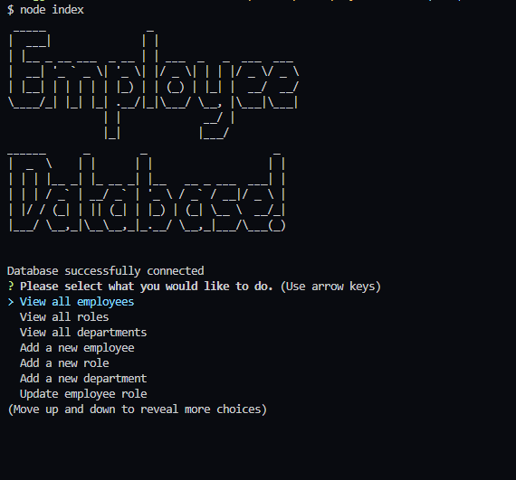

# Employee Tracker Application


## Description

The purpose in creating this application was for users who would like an easily accessible database for all of the employees in the users' company.

Being able to track and modify as employees have their roles changed, new departments are added, new roles are added, managerial shifts, and even employees departing the company.

This project currently only supports viewing (all employees, all departments, all roles), adding (new roles, departments, employees), and updating existing employees' roles.

Further development of this project will support departure of employees, management changes, etc.

If you would like to see how this application works, please click [here](https://www.youtube.com/watch?v=pCEVAsho45k) to check out the demo video!

## Table of Contents

1. [Installation](#installation)
2. [Usage](#usage)
3. [Questions](#questions)
4. [License](#license)

## Installation

In order to utilize this application, clone the respository down to your computer.

Once you have cloned it, run the following code block to obtain all the packages needed to run the application.

- mysql2
- console.table
- figlet
- inquirer
- dotenv

```
npm i
```

Once you have downloaded all of the packages, you would have to create a .env file within the folder.

Once the .env file is created, simply add the following into the file.
Note: You would have to fill these out yourselves based on your machine and your passwords.

```
DB_USER= (fill in here)
DB_NAME= (fill in here)
DB_PASSWORD= (fill in here)
```

You would then have to run the sql files in mysql through

```
mysql -u root -p
source schema.sql
source seeds.sql
```

## Usage

In order to run the program, you would have to run the code block below:

```
node index.js
```

Once you do and you see the image below on your terminal, you are ready to use the application!

### Screenshot of beginning page



## Questions

If you have any questions, please feel free to reach out to me via:

1. Email: dhong0925@gmail.com
2. GitHub: Lunirs

## License

Licensed under the MIT license.

## Credits

Copyright © Daniel Hong All rights reserved.
